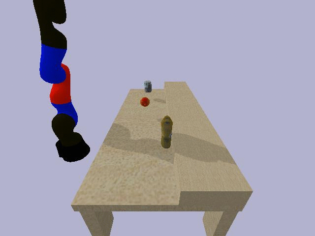
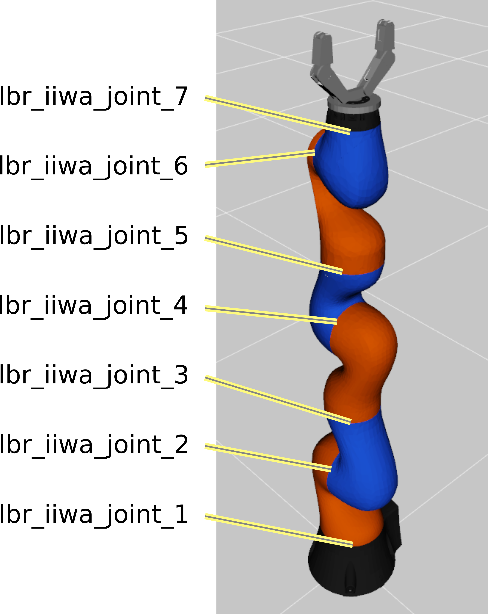
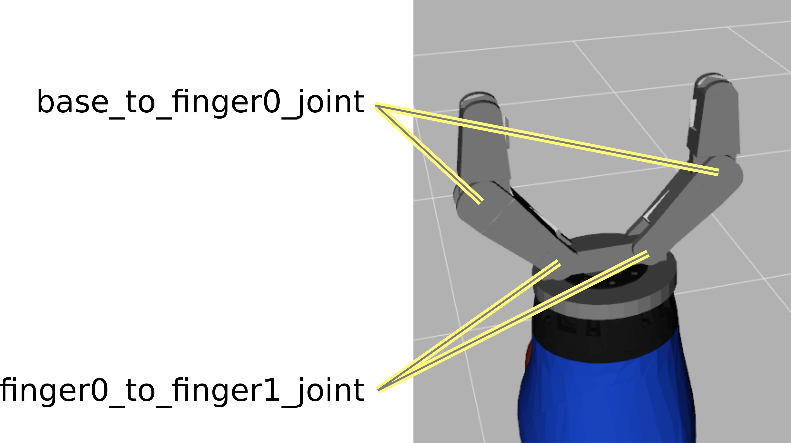
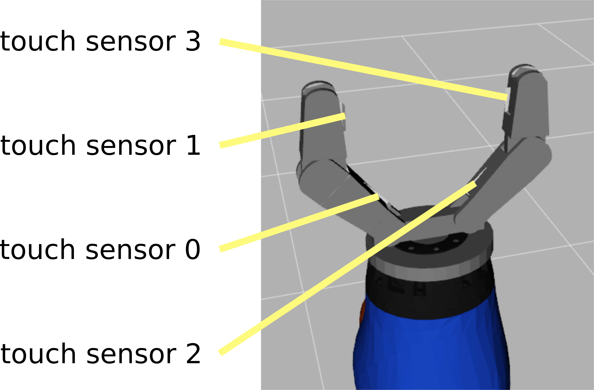

# REALCompetitionStartingKit
Tested on Ubuntu (>= Ubuntu 16.04)

<TABLE " width="100%" BORDER="0">
<TR>
<TD></TD>
<TD></TD>
<TD></TD>
</TR>
</TABLE>

### Install

The installation requires Python 3.5+.

#### Linux

To install the REAL Competition Starting Kit on linux

1) install gym and pybullet packages:

       pip install gym pybullet pyopengl

2) download the REALCompetitionStartingKit repo:

       git clone https://github.com/GOAL-Robots/REALCompetitionStartingKit.git

3) install the REALCompetitionStartingKit package:

       cd REALCompetitionStartingKit
       pip install -e .

#### Windows - anaconda


To install the REAL Competition Starting Kit on windows in the anaconda enviroment

1) install microsoft Visual Studio c++14 - community at https://visualstudio.microsoft.com/visual-cpp-build-tools/

2) install the anaconda environment for windows at https://www.anaconda.com/distribution/#windows

3) create a python virtual environment

       conda create -n pyenv numpy pip

4) activate the virtual environment

       conda activate pyenv

3) install gym and pybullet packages:

       pip install gym pybullet pyopengl

4) download the REALCompetitionStartingKit repo:

       git clone https://github.com/GOAL-Robots/REALCompetitionStartingKit.git

5) install the REALCompetitionStartingKit package:

       cd REALCompetitionStartingKit
       pip install -e .


### Basic usage

The environment is a standard gym environment and can be called alone as shown here:

```python
env = gym.make('REALComp-v0')

observation = env.reset()  
for t in range(10):
    
    # Call your controller to chose action 
    action = controller.step(observation, reward, done)
    
    # do action
    observation, reward, done, _ = env.step(action)   
```
    
where the controller is any object with a step() attribute returning an action vector.
A  exammple type of the controller is given by this simple class:

```python
class FakePolicy:
    """
    A fake controller chosing random actions
    """
    def __init__(self, action_space):
        self.action_space = action_space
        self.action = np.zeros(action_space.shape[0])

    def step(self, observation, reward, done):
        """
        Returns a vector of random values
        """
        self.action += 0.1*np.pi*np.random.randn(self.action_space.shape[0])
        return self.action
```

It includes a 7DoF kuka arm with a 2Dof gripper, a table with 3 objects on it and a camera looking at the table from the top. 
The gripper has four touch sensors on the inner part of its links.

#### Action
The ```action```attribute  of ```env.step``` must be a  vector of 9 joint positions in radiants.
The first 7 joints have a range between -Pi/2 and +Pi/2.
The two gripper joints have a range between 0 and +Pi/2. They are also coupled so that the second joint will be at most twice the angle of the first one.


<TABLE " width="100%" BORDER="0">
<TR>
<TD>
       
| index |  joint name               |
| ----- | ------------------------- |
|  0    |  lbr_iiwa_joint_1         |
|  1    |  lbr_iiwa_joint_2         |
|  2    |  lbr_iiwa_joint_3         |
|  3    |  lbr_iiwa_joint_4         |
|  4    |  lbr_iiwa_joint_5         |
|  5    |  lbr_iiwa_joint_6         |
|  6    |  lbr_iiwa_joint_7         |
|  7    |  base_to_finger0_joint    |
|  8    |  finger0_to_finger1_joint |

</TD>
<TD></TD>
<TD></TD>
</TR>
</TABLE>

#### Observation
The ```observation``` object returned by```env.step``` is a dictionary:
* observation["joint_positions"] is a vector containing the current angles of the 9 joints
* observation["touch_sensors"] is a vector containing the current touch intensity at the four touch sensors (see figure below)
* observation["retina"] is a 240x320x3 array with the current top camera image
* observation["goal"] is a 240x320x3 array with the target top camera image (all zeros except for the extrinsic phase, see below the task description)

<TABLE " width="100%" BORDER="0">
<TR>
</TD>
<TD></TD>
</TR>
</TABLE>
For each sensor, intensity is defined as the maximum force that was exerted on it at the current timestep.

#### Reward

The ```reward```  value returned by```env.step``` is always put to 0.

#### Done

The ```done```  value returned by```env.step``` is  set to ```True``` only when a phase is concluded (see below - intrinsic and extrinsic phases) 


### Task

A complete simulation is made of two phases:
* ***Intrinsic phase***: No goal is given and the controller can do whatever it needs to explore and learn something from the environment. This phase will last 10 million timesteps.
* ***Extrinsic phase***: divided in trials. On each trial a goal is given and the controller must chose the actions that modify the environment so that the state corresponding to the goal is reached within 1000 timesteps.

[realcomp/examples/demo.py](realcomp/task/demo.py)  runs the entire simulation. The participants are supposed to substitute the MyController object in  [realcomp/task/my_controller.py](realcomp/examples/my_controller.py)  with their own controller object.
